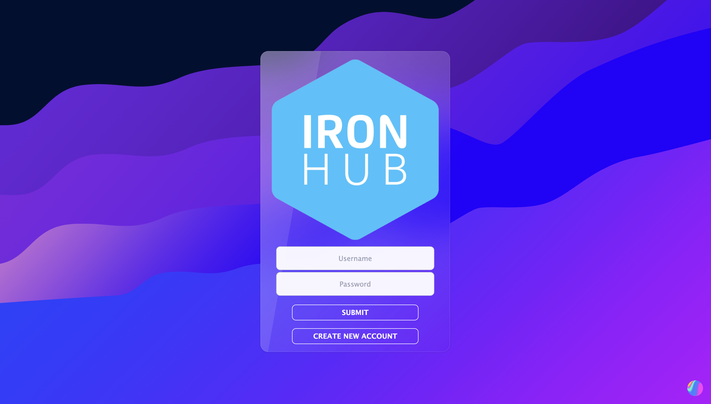

## <p align="center" dir="auto"></p>

<br>


## Description:

A plataform by Ironhackers to Ironhackers to showcase projects done during the bootcamp all around the world! 💻🚀🌎✨

<br>

## User Stories:

- **404** - As a user, I want to see a nice 404 page when I go to a page that doesn’t exist so that I know it was my fault.
- **500** - As a user, I want to see a nice error page when the super team screws it up so that I know that is not my fault.
- **sign up** - As a user, I want to sign up.
- **login** - As a user, I want to be able to log in.
- **logout** - As a user, I want to be able to log out.
- **search** - As a user, I want to be able to search for other profiles based on the filters I use.
- **search result** - As a user, I want to be able to see the list of profiles filtered by my preferences.
- **profile** - As a user I want to be able to display my projects and my information.
- **edit profile** - As a user, I want to be able to edit my profile.
- **projects** - As a user, I want to be able to see all the projects and comments.
- **new project** - As a user, I want to be able to create a new project. 
- **edit project** - As a user, I want to be able to edit projects.


<br>


## Server Routes (Back-end):

<br>


| **Method** | **Route**                          | **Description**                                              | Request  - Body                                          |
| ---------- | ---------------------------------- | ------------------------------------------------------------ | -------------------------------------------------------- |
| `GET`      | `/`                                | Login when Logged Out, Search when Logged In route.  Renders login `login` view when logged out and `search` view when logged in.                 |                                                          |                               |                                                          |
| `POST`     | `/login`                           | Sends Login form data to the server.                         | { username, password }                                      |
| `GET`     | `/logout`                           | Logs out the user and redirects to the login.                         |                                       |
| `GET`      | `/signup`                          | Renders `signup` form view.                                  |                                                          |
| `POST`     | `/signup`                          | Sends Sign Up info to the server and creates user in the DB. | {  username, name, surname, ironpass, password, campus, course }                                    |
| `GET`      | `/profile/:username`         | Private route. Renders `profile` view for the user profile. |                                                          |
| `GET`      | `/profile/:username/edit-profile`            | Private route. Renders `edit-profile` view.             |                                                          |
| `POST`      | `profile/:username/edit-profile`            | Sends edit-profile info to server and updates user in DB. | { profile picture, username, name, surname, campus, course, location, email, website, linkedin, instagram, bio } |
| `GET`      | `/search`         | Private route. Renders `search`.  |                                                          |
| `GET`      | `/search/results`         | Private route. Renders `search-results`. |                                                        | 
| `GET`      | `/:username/projects`         | Private route. Renders `project`. |                                                          |
| `GET`      | `/:username/projects/new`         | Renders `new-project`. Private route. View for a specific project page. |                                                          |
| `POST`      | `/:username/projects/new`         | Sends New Project info to the server and creates it. |      { image, title, description, link }                                                    | 
| `GET`      | `/projects/:projectId/edit-project`         | Private route. Renders `edit-project`.|                                                          |
| `POST`      | `/projects/:projectId/edit-project`         | Sends Edit Project info to the server and updates it.|  { image, title, description, link }                                                         |
| `GET`      | `/projects/:projectId/delete-project`         | Private route. Deletes a project. Redirects user to `profile`.|                                               |
| `POST`      | `/:projectId/comments/:username`         | Sends Comments info to the server and creates it. |  { image, title, description, link }                                                         |
| `GET`      | `/profile/:username/delete-profile`         | Private route. Deletes user. Redirects user to `signup`  |     |


<br><br>

## Models:
<br>
<strong>User model:</strong>
<br>

```javascript
{
  name: {
    type: String,
    required: true,
    trim: true
  }
  surname: {
    type: String,
    required: true,
    trim: true
  },
  username: {
    type: String,
    required: true,
    unique: true
    lowercase: true,
    trim: true,
    maxlength: 20
  }
  password: {
    type: String,
    required: true
  },
  ironpass: {
    type: String,
    required: true,
  },
  course: {
    type: String,
    required: true,
    enum: ['Web Dev', 'UX/UI', 'Data Analyst', 'Cybersecurity']
  },
  campus: {
    type: String,
    required: true
  },
  profilepicture:{
    type: String,
    default: 'url'
 },
 location: {
    type: String
},
  email: {
    type: String
},
  website: {
    type: String,
    set: removeHttp
},
  linkedin: {
    type: String,
    set: removeHttp
},
  instagram: {
    type: String,
    set: removeHttp
},
  bio: {
    type: String
},
  projects: [{ type: Schema.Types.ObjectId, ref: 'Project' }],
  comments: [{ type: Schema.Types.ObjectId, ref: "Comment" }],
}

```

<br><strong>Project model:</strong>

```javascript

{
  author: { type: Schema.Types.ObjectId, ref: "User" },
  image: {
    type: String
},
  title: {
    type: String,
    required: true
},
  description: {
    type: String,
    required: true
},
  link: {
    type: String,
    set: removeHttp
},
  comments: [{ type: Schema.Types.ObjectId, ref: "Comment" }],
},


```
<br>
<strong>Comments model:</strong>

```javascript

{
  project: { type: Schema.Types.ObjectId, ref: "Project" },
  author: { type: Schema.Types.ObjectId, ref: 'User' },
  comment: { type: String, required: true },
},


```


<br>


## Packages:
```
ExpressJS
NodeJS
MongoDB
TailwindCSS
```


<br>


<br><h1 align="center" dir="auto"><strong>Ironhub</strong></h1>


<a href="https://project2ironhack.herokuapp.com" target="_blank">
</a>

<br><br>


## Links:

[Repository](https://github.com/lzaquine/Ironhub)

[Deploy](https://project2ironhack.herokuapp.com)


<br>


## Slides:

[Slides Link](https://docs.google.com/presentation/d/1P5FIi0vHZBUcgUtmt1M4_lLCO5dwdJ4UOgtJa4ehGfk/edit?usp=sharing)

<br>

### Contributors:
⚒️ Lucas Zaquine - [`Github`](https://github.com/lzaquine) - [`Linkedin`](https://www.linkedin.com/in/lucaszaquine)

🗿 Paulo Torres - [`Github`](https://github.com/pveg) - [`Linkedin`](https://www.linkedin.com/in/pveg)
